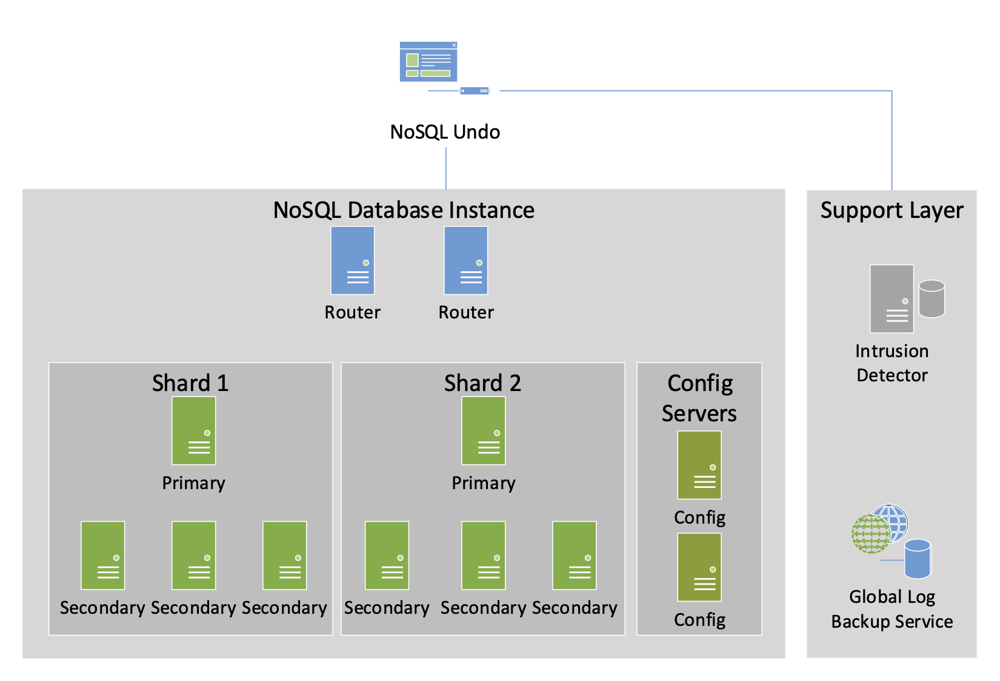
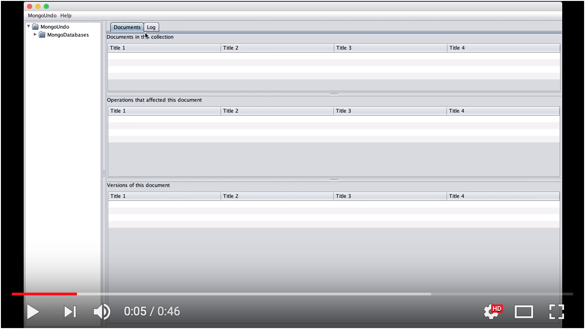

# NoSQL-Undo

NoSQL-Undo is a recovery approach and tool that allows database administrators to remove the effect of undesirable actions by undoing operations, leading the system to a consistent state. NOSQL UNDO leverages the logging and snapshot mechanisms built-in NoSQL databases, and is able to undo operations as long as they are present in the logs.



Currently NoSQL Undo only supports MongoDB, it is possible to extend it to support other NoSQL databases.

## Getting Started

These instructions will get you a copy of the project up and running on your local machine for development and testing purposes. See deployment for notes on how to deploy the project on a live system.

### Prerequisites

 * Install Maven before proceeding;
 * Make sure you have MongoDB installed in your system or, as an alternative, Docker.


Before starting NoSQL - Undo make sure you have a MongoDB instance running as `MASTER` this is required so that Mongo keeps operation logs to allow recovery.

You can run MongoDB locally with the `--master` option by executing this command:

```
mongod --master
```

Or via docker with the following command:

```
docker run --name mongoundo -p 27017:27017 -d mongo:3.2.1 mongod --master
```


### Installing

Before running NoSQL-Undo execute the following command in the root of project:

```
mvn compile
```


## Running NoSQL-Undo

To execute NoSQL Undo execute the following command:

```
mvn exec:java
```


This video show an example of how to recover a document:


[](https://youtu.be/w0FeMMF4nUc)


## Built With

* [Maven](https://maven.apache.org/) - Dependency Management

## Authors

* **David Matos** - *Development of the tool* - [GitHub](https://github.com/davidmatos)

## License

This project is licensed under the MIT License - see the [LICENSE.md](LICENSE.md) file for details

## Acknowledgments

* **[Prof. Miguel Correia](https://github.com/mpcorreia)**
